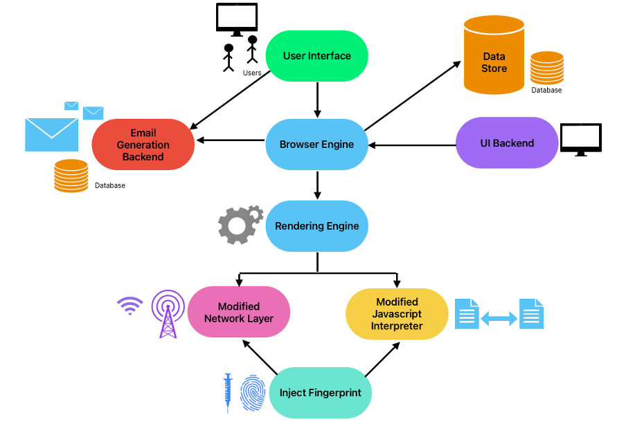

# PryGuard

PryGuard is a privacy-centric web browser designed to enhance online security and anonymity. It provides robust defenses against advanced tracking techniques such as cross-site tracking, browser fingerprinting, and cookie containerization, offering a secure and customizable browsing experience.

## Features

- **Anti-Fingerprinting**: Injects customizable browser fingerprints to prevent tracking.
- **Cookie Containerization**: Isolates cookies per browsing profile to enhance session privacy.
- **Proxy Management**: Supports IP masking with multiple proxy options for anonymity.
- **Temporary Email Generation**: Enables disposable email creation using the Cloudflare API for anonymous interactions.
- **Privacy-Focused Architecture**: Built on WPF and MVVM, ensuring scalability and separation of concerns.
- **Modern Web Compatibility**: Uses CefSharp (Chromium Embedded Framework) for seamless browsing and modern web standards.
- **Customizable UI**: Offers themes, bookmarks, search history, downloads, and developer tools.
- **Developer Tools**: Includes element inspection, JavaScript debugging, and resource monitoring tools for advanced users.

## High Level Architecture

## Comparison with Similar Browsers

PryGuard stands out in the privacy-focused browser space by integrating multiple layers of protection and customization. While browsers like **Incogniton**, **Multilogin**, **Kameleo**, and **ixBrowser** provide specific functionalities, PryGuard combines these features with additional privacy measures like temporary email generation and cookie containerization. 

Our work has been inspired by **Invise**, a privacy-centric browser that paved the way for advanced anti-fingerprinting techniques and enhanced user anonymity.

## Installation

1. Download the latest release from the [Releases](https://github.com/pannagkumaar/PryGuard/releases) section.
2. Extract the contents of the release archive.
3. Run `PryGuard.exe` to start the browser.

## Release Contents

The release package includes:
- `PryGuard.exe`: The executable file to launch the browser.
- Supporting libraries and dependencies required for full functionality.

## Contributing

Contributions are welcome! Please refer to the `CONTRIBUTING.md` file for guidelines.

## License

This project is licensed under the MIT License. See the [LICENSE](./LICENSE) file for details.
